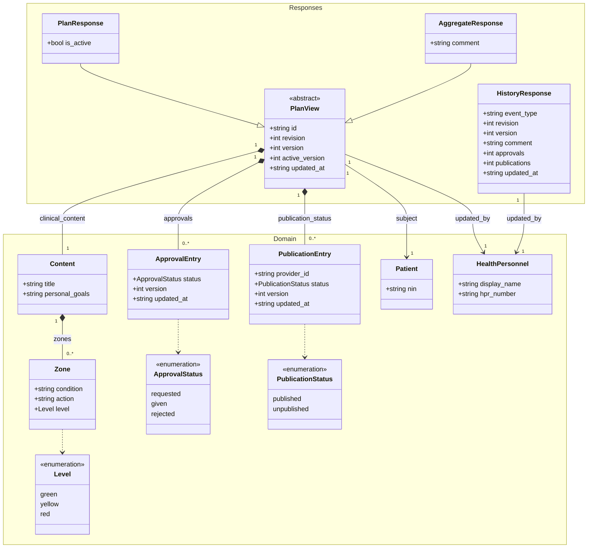

# modell

```mermaid
classDiagram
    direction TB

    namespace Responses {
        class PlanView {
            <<abstract>>
            +string id
            +int revision
            +int version
            +int active_version
            +string updated_at
        }
        class PlanResponse {
            +bool is_active
        }
        class AggregateResponse {
            +string comment
        }
        class HistoryResponse {
            +string event_type
            +int revision
            +int version
            +string comment
            +int approvals
            +int publications
            +string updated_at
        }
    }

    namespace Domain {
        class Patient {
            +string nin
        }
        class HealthPersonnel {
            +string display_name
            +string hpr_number
        }
        class Content {
            +string title
            +string personal_goals
        }
        class Zone {
            +string condition
            +string action
            +Level level
        }
        class ApprovalEntry {
            +ApprovalStatus status
            +int version
            +string updated_at
        }
        class PublicationEntry {
            +string provider_id
            +PublicationStatus status
            +int version
            +string updated_at
        }
        class Level {
            <<enumeration>>
            green
            yellow
            red
        }
        class ApprovalStatus {
            <<enumeration>>
            requested
            given
            rejected
        }
        class PublicationStatus {
            <<enumeration>>
            published
            unpublished
        }
    }

    %% PlanView is not in the JSON schema; it holds what PlanResponse and AggregateResponse share.
    %% Written child --|> parent so the subclasses rank above PlanView and Responses stays above Domain.
    PlanResponse --|> PlanView
    AggregateResponse --|> PlanView

    PlanView "1" *-- "1" Content : clinical_content
    PlanView "1" *-- "0..*" ApprovalEntry : approvals
    PlanView "1" *-- "0..*" PublicationEntry : publication_status
    Content "1" *-- "0..*" Zone : zones

    PlanView "1" --> "1" Patient : subject
    PlanView "1" --> "1" HealthPersonnel : updated_by
    HistoryResponse "1" --> "1" HealthPersonnel : updated_by

    Zone ..> Level
    ApprovalEntry ..> ApprovalStatus
    PublicationEntry ..> PublicationStatus
```